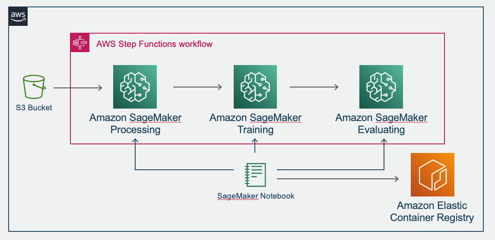

# SageMaker-MLWorkFlow-XGBoost-sdkv2
This is an implementation of Machine Learning Workflow using SageMaker ans StepFunctions on AWS through churn detection with XGBoost.

## requirments
- AWS accounts
- ap-notrheast-1 (Tokyo) region
- must need to execute on SageMaker Notebook Instance

## Description
### data preparing
- Downloading dataset used in this sample.

`DataPreparing.ipynb`

### data processing process

- Obsering dataset
- Creating Docker image to use SageMaker processing

`DataProcessing.ipynb`

`Dockerfile`

### Training

- Trainig using SageMaker
- Evaluating using SageMaker Endpoint
- Evaluating using SageMaker processing

`Training.ipynb`

`Dockerfile-evaluation`

### Creating Machine Leanring Workflow

- StepFunction as a Machine Learning Workflow

`MLWorkflow.ipynb`

---
Copyright (c) 2020 Masahiro Imai Released under the MIT license